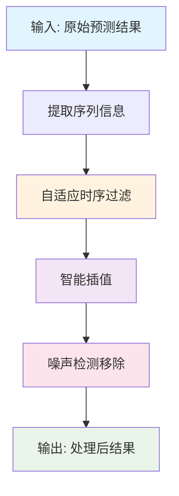
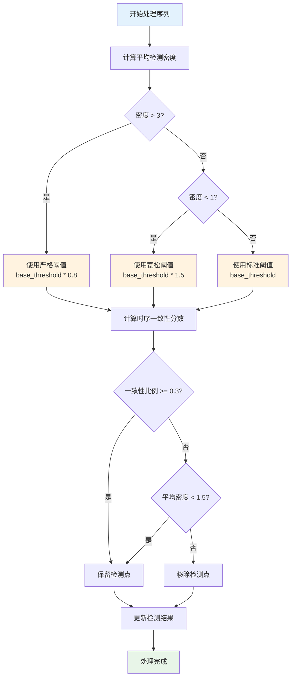
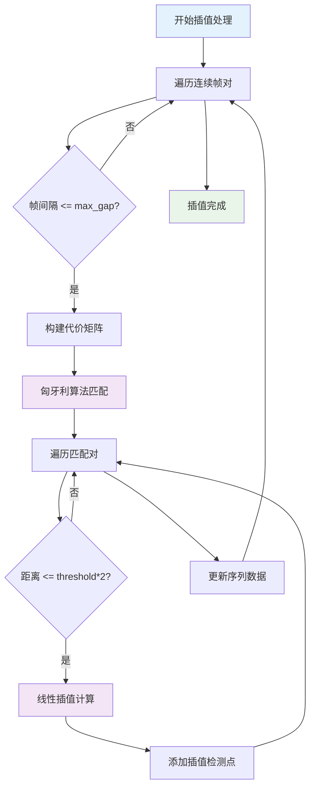
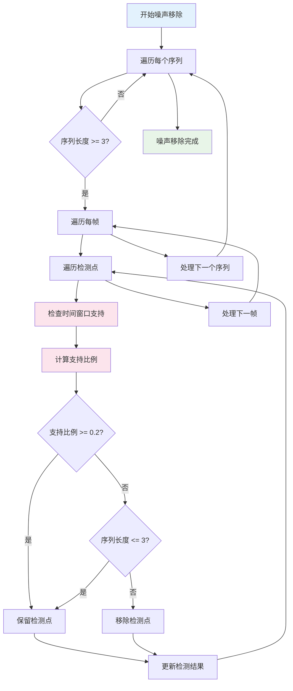
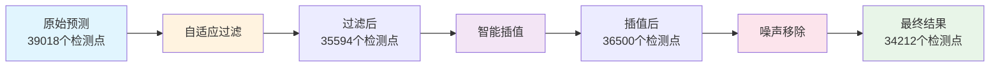
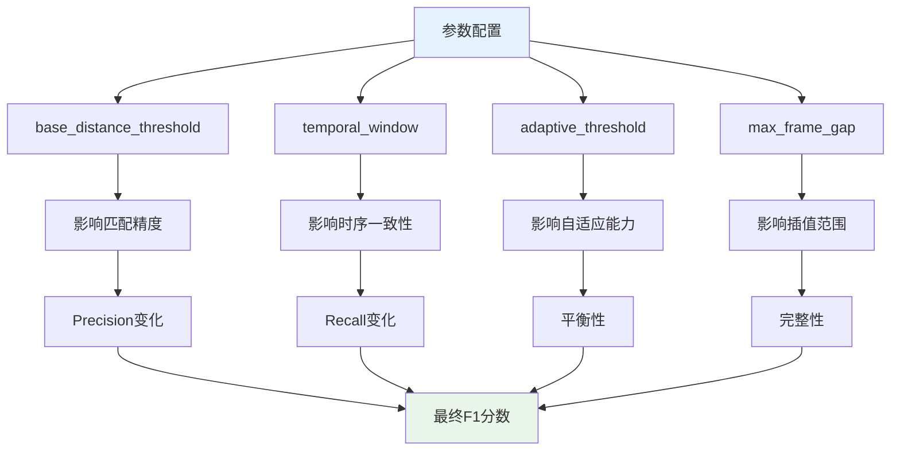
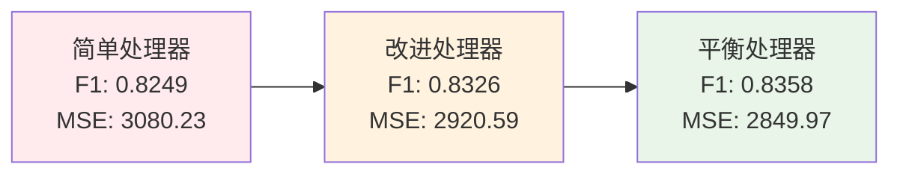

# BalancedSequenceProcessor 工作流程图

## 整体流程



## 详细流程图

### 1. 自适应时序过滤流程



### 2. 智能插值流程



### 3. 噪声检测移除流程



## 数据流图



## 参数影响图



## 性能对比图



## 关键决策点

### 1. 阈值选择决策
```
检测密度 > 3: 使用严格阈值 (0.8 * base_threshold)
检测密度 < 1: 使用宽松阈值 (1.5 * base_threshold)
其他情况: 使用标准阈值 (base_threshold)
```

### 2. 检测点保留决策
```
条件1: 时序一致性比例 >= 0.3
条件2: 平均检测密度 < 1.5
满足任一条件则保留检测点
```

### 3. 插值匹配决策
```
距离 <= 2 * base_threshold: 进行插值
距离 > 2 * base_threshold: 跳过插值
```

### 4. 噪声移除决策
```
支持比例 >= 0.2: 保留检测点
序列长度 <= 3: 保留检测点
其他情况: 移除检测点
```

## 算法复杂度分析

| 步骤 | 时间复杂度 | 空间复杂度 | 说明 |
|------|------------|------------|------|
| 序列信息提取 | O(n) | O(n) | n为图像数量 |
| 自适应过滤 | O(n * m * w) | O(n) | m为平均检测点数，w为时间窗口 |
| 智能插值 | O(n * m²) | O(m²) | 匈牙利算法复杂度 |
| 噪声移除 | O(n * m * w) | O(n) | 与过滤步骤类似 |

**总体复杂度**: O(n * m²)，其中n为图像数量，m为平均检测点数。 